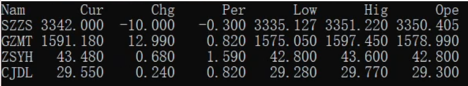

# MASK

一个伪装的查看股票实时行情的`Linux`程序，类似`top`命令在服务器上运行，实时抓取[雪球网站](https://xueqiu.com)的数据。

[amd64程序下载](https://github.com/xieyanker/mask/releases/download/v1.0.1/mask-amd64-v1.0.1.tar.gz)

[arm64程序下载](https://github.com/xieyanker/mask/releases/download/v1.0.1/mask-arm64-v1.0.1.tar.gz)

### 一、 How to build?

```shell
# amd64
GOARCH=amd64 CGO_ENABLED=0 go build
# arm64
GOARCH=arm64 CGO_ENABLED=0 go build
```

### 二、 How to config?

##### 1. 目录结构

可执行程序`mask`与配置文件`conf/mask.json`的结果关系如下：

```shell
# tree
.
├── conf
│   └── mask.json
└── mask

1 directory, 2 files
```

##### 2. 更新配置文件

```shell
vim conf/mask.json
```

将你准备跟踪的股票编号与名称填入到`json`文件中，`id`根据不同交易所进行区分，如上交所为`SH`，深交所为`SZ`。

数据均来源于[雪球网站](https://xueqiu.com)，可到网站上查找对应的编号信息。

`name`是股票的名称，为了伪装，建议不要使用真实名称(会被发现)，可以使用名称缩写等具有迷惑性的名称。

如以下默认配置文件中的股票分别代表`上证指数` `贵州茅台` `招商银行` `长江电力`。

```json
{
  "list": [
    {
      "id": "SH000001",
      "name": "SZZS"
    },
    {
      "id": "SH600519",
      "name": "GZMT"
    },
    {
      "id": "SH600036",
      "name": "ZSYH"
    },
    {
      "id": "SH600900",
      "name": "CJDL"
    }
  ]
}
```

### 三、 How to run?

```shell
./mask
```




### 四、 How to read?

1. 每隔2s会自动刷新数据行情

2. 输出列表是按照`json`文件中的配置顺序进行自动排序

3. 为了美观，小数点均保留3位数

4. 每一列的含义：

| Nam | Cur | Chg | Per | Low | Hig | Ope |
| - | - | - | - | - | - | - |
| Name | Current | Change | Percent | Low | Hig | Open |
| 名称 | 实时价格 | 相比昨天的变化值 | 相比昨天变化值的百分比 | 当日最低价 | 当日最高价 | 当日开盘价 |


